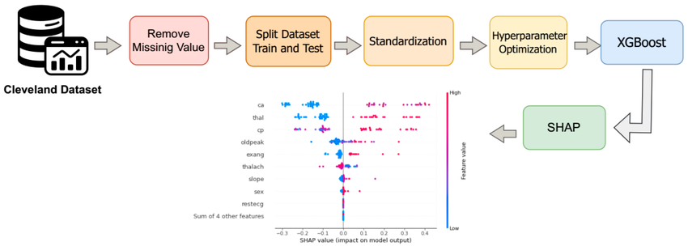

# Understanding the Importance of Calibrating Machine Learning Models

<p>
  
</p>

[img source:](https://www.researchgate.net/figure/Workflow-of-the-proposed-second-approach-using-the-XGBoost-model-on-the-Cleveland_fig5_398463844)

## Project Description

This project builds XGBoost classification models, a non-calibrated model and then a calibrated model for heart disease classification.

The project relies on the heart disease dataset, a reliable and extensively used resource in cardiovascular research medical, studies, and machine learning applications. While the original dataset has 76 attributes or features, the dataset used here only uses 14 crucial features linked to heart disease diagnoses. The **target** or prediction is a binary classification indicating whether a patient has heart disease (target = 1) or not (target = 0).

In this project using the UCI Heart Disease dataset, I illustrate that although, we should strive to have the most calibrated models, that in this case, calibrating an XGBoost model for the given dataset does not provide an improvement with regards to interpreting “a risk score” for heart disease.

### The Problem

**The project addresses the problems of blindly thinking a calibration model is always best and how to better explaine understand how a seemingly “black box” model like XGBoost works through an examination of its features.**

In this project using the UCI Heart Disease dataset, I illustrate that although, we should strive to have the most calibrated models, that in this case, calibrating an XGBoost model for the given dataset does not provide an improvement with regards to interpreting “a risk score” for heart disease.

At the same time, to help understand why my XGBoost model made decisions, I perform **Feature Importance** analysis and show how Feature Importance provides:

- A sanctity check for the model, aligning the model's logic with real life medical reality

- A rationale for why certain patient data yields a high risk for heart disease based on specific features. For example, "Your risk is high primarily because of your thalach (max heart rate) and ca (number of major vessels)."

I use Cover, Gain, Weight and SHaply Additive exPlanations (SHAP) for this Feature Importance analysis.

### What this Project Does Specifically

The project:

- Loads and inspects the UCI Heart Disease data
- Preprocesses/cleans the data
- Performs exploratory data analysis (EDA)
  - Statistical summary of the data
  - Checking for outliers in continuous features and mitigating (i.e., removing extremes that don't make sense)
  - Check for imbalance data in the categorical features, especially the target feature/variable.
  - Fix imbalances
  - Scaling the data
  - Feature engineering
    - Categorical encodings
- Split data into test, train, and validation datasets making sure to avoid data leakage
- Create two different classifiers: non-calibrated XGBoost model and a calibrated XGBoost model
- Tuning the XGBoost hyperparameters
- Perform feature importance analysis using: Cover, Gain, Weight and SHAP for result interpretation
- Calculate before and after Brier scores to show calibration improvement or not
- Show how to use calibrated model

---

## Objective

The project contains the key elements:

- `brier` Score,
- `Calibration` for ML models,
- `Git` (version control),
- `GridSearchCV` tunes XGBoost hyperparameters
- `Jupyter` Python coded notebooks,
- `Matplotlib` visualization of data,
- `Numpy` for arrays and numerical operations,
- `Pandas` for dataframe usage,
- `Pipeline` for tuning and scaling,
- `Python` the standard modules,
- `Seaborn` visualization of data,
- `Scikit-Learn` to get training and test datasets,
- `SHAP` for feature importance,
- `uv` package management including use of `ruff` for linting and formatting,
- `XGBoost` model package

## Tech Stack


---

## Getting Started

Here are some instructions to help you set up this project locally.

---

## Installation Steps

The Python version used for this project is `Python 3.12 or higher`.

### Clone the Repo

1. Clone the repo (or download it as a zip file):

   ```bash
   git clone https://github.com/beenlanced/ml_mentoring_xgboost.git
   ```

2. Create a virtual environment named `.venv` using `uv` Python version 3.12:

   ```bash
   uv venv --python=3.12
   ```

3. Activate the virtual environment: `.venv`

   On macOS and Linux:

   ```bash
   source .venv/bin/activate #mac
   ```

   On Windows:

   ```bash
    # In cmd.exe
    venv\Scripts\activate.bat
   ```

4. Install packages using `pyproject.toml` or (see special notes section)

   ```bash
   uv pip install -r pyproject.toml
   ```

### View Notebooks to see Data Gathering, Exploratory Data Analysis, Predicative Model Construction, Feature Importance Analysis, and Calibration

---

## Dataset

I used use open-source datasets from Kaggle: [heart.csv](https://www.kaggle.com/datasets/arezaei81/heartcsv).

---

### Final Words

Thanks for visiting.

Give the project a star (⭐) if you liked it or if it was helpful to you!

You've `beenlanced`! 😉

---

## Acknowledgements

I would like to extend my gratitude to all the individuals and organizations who helped in the development and success of this project. Your support, whether through contributions, inspiration, or encouragement, have been invaluable. Thank you.

Specifically, I would like to acknowledge:

- Data from [heart.csv](https://www.kaggle.com/datasets/arezaei81/heartcsv).

- [Hema Kalyan Murapaka](https://www.linkedin.com/in/hemakalyan) and [Benito Martin](https://martindatasol.com/blog) for sharing their README.md templates upon which I have derived my README.md.

- The folks at Astral for their UV [documentation](https://docs.astral.sh/uv/)

---

## License

This project is licensed under the MIT License - see the [LICENSE](./LICENSE) file for details
